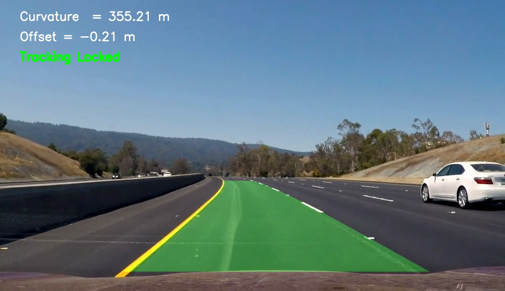

[](http://www.udacity.com/drive)

**Advanced Lane Finding Project**

The goals / steps of this project are the following:

* Compute the camera calibration matrix and distortion coefficients given a set of chessboard images.
* Apply a distortion correction to raw images.
* Use color transforms, gradients, etc., to create a thresholded binary image.
* Apply a perspective transform to rectify binary image ("birds-eye view").
* Detect lane pixels and fit to find the lane boundary.
* Determine the curvature of the lane and vehicle position with respect to center.
* Warp the detected lane boundaries back onto the original image.
* Output visual display of the lane boundaries and numerical estimation of lane curvature and vehicle position.

## [Rubric](https://review.udacity.com/#!/rubrics/571/view) Points

### Here I will consider the rubric points individually and describe how I addressed each point in my implementation.  

---

### Writeup / README

#### 1. Provide a Writeup / README that includes all the rubric points and how you addressed each one.  You can submit your writeup as markdown or pdf.  [Here](https://github.com/udacity/CarND-Advanced-Lane-Lines/blob/master/writeup_template.md) is a template writeup for this project you can use as a guide and a starting point.  

You're reading it!

### Camera Calibration

#### 1. Briefly state how you computed the camera matrix and distortion coefficients. Provide an example of a distortion corrected calibration image.

The code for this step is contained in the third code cell of the IPython notebook located in the file [lanelines.ipynb](https://github.com/emiranda927/CarND-Advanced-Lane-Lines/blob/master/lanelines.ipynb)

I start by preparing "object points", which will be the (x, y, z) coordinates of the chessboard corners in the world. Here I am assuming the chessboard is fixed on the (x, y) plane at z=0, such that the object points are the same for each calibration image.  Thus, `objp` is just a replicated array of coordinates, and `objpoints` will be appended with a copy of it every time I successfully detect all chessboard corners in a test image.  `imgpoints` will be appended with the (x, y) pixel position of each of the corners in the image plane with each successful chessboard detection.  

```python
ret, corners = cv2.findChessboardCorners(gray,(nx,ny),None)

        #append points and calculate coefficients and image matrix
        if ret == True:
            imgpoints.append(corners)
            objpoints.append(objp)
```


I then used the output `objpoints` and `imgpoints` to compute the camera calibration and distortion coefficients using the `cv2.calibrateCamera()` function.  I applied this distortion correction to the test image using the `cv2.undistort()` function (housed in the perspective transform method) and obtained this result: 


### Pipeline (single images)

#### 1. Provide an example of a distortion-corrected image.

To demonstrate this step, I have a distortion corrected image next to one of the test images where you can see the difference around the edge of the image:


#### 2. Describe how (and identify where in your code) you used color transforms, gradients or other methods to create a thresholded binary image.  Provide an example of a binary image result.

I used a combination of color and gradient thresholds to generate a binary image (thresholding steps in cell 4 in `lanelines.ipynb`). I experimented with many different colorspace including HSV, HLS, YUV, YCbCr, LAB, and more. Different colorspaces seemed to be good at different things and the experimentation of figuring things out, like which color spaces dealt with shadows or yellow lines more effectively, eventually devolved into trial and error. Here's an example of the code with commented out sections that might give you an idea of how this process went for me:
```python
#combine thresholds to create a single binary image
    combined = np.zeros_like(dir_binary)
    combined[((gradx == 1) & (grady == 1)) |
             ((mag_binary == 1) & (dir_binary == 1)) |
             ((v_binary == 1)&(s_binary == 1)) |
             #((y_binary == 1)&(s_binary == 1)) |
             #((b_binary == 1)&(y_binary == 1))|
             (r_binary == 1) |
             (g_binary == 1)| (lab_binary == 1) | (ycbcr_binary == 1)
            ] = 1  
```
Here's an example of my output for this step (note: the image has perspective transform already applied):


#### 3. Describe how (and identify where in your code) you performed a perspective transform and provide an example of a transformed image.

The code for my perspective transform includes a function called `perspective_transform()`, which appears in code cell 4 of the .ipynb notebook.  The `perspective_transform()` function takes as input an image (`img`), and the transform matrix information. The `perspective_transform()` function performas all the undistortion and has source and destination  points hardcoded.

```python
src = np.float32([[img.shape[1]*(.5 - mid/2), img.shape[0]*height], [img.shape[1]*(.5 + mid/2), img.shape[0]*height],[img.shape[1]*(.5 + bot/2), img.shape[0]*bot_trim], [img.shape[1]*(.5 - bot/2), img.shape[0]*bot_trim]])

dst = np.float32([[offset, 0], [img_size[0] - offset, 0], [img_size[0] - offset, img_size[1]], [offset, img_size[1]]])
```
Here is an example of a transformed image:


#### 4. Describe how (and identify where in your code) you identified lane-line pixels and fit their positions with a polynomial?

I used the perspective transformed image to generate binary images through the `threshold()` function, which only took an image as an argument. The binary image was fid through the function `sliding_window_fit()` which uses a sliding window to detect activated binary pixels in a certain range and declaring them a lane line based on margins and number of pixels within a window. Once the activated pixels are selected, a secondary order polynomial  is fit with `np.polyfit`. This code is located in cell 5 of the IPython Notebook. Here is an example of the output from this function:


Once the line has been detected and fit, I implemented a `skip_fit()` function that searches for lane pixels in a certain area based on the last detection. This speeds up the lane finding process. An example of the search area using `skip_fit()` can be seen below:


#### 5. Describe how (and identify where in your code) you calculated the radius of curvature of the lane and the position of the vehicle with respect to center.

I defined a `curvature` function that calculates the lane line curvature of each polynomial fit passed into the function. This code is located at the bottom of cell 5. I assumed the vehicle camera was mounted at center.

#### 6. Provide an example image of your result plotted back down onto the road such that the lane area is identified clearly.

I implemented this step in cell 6 in the function `process_image()`.  Here is an example of my result on a test image:



---

### Pipeline (video)

#### 1. Provide a link to your final video output.  Your pipeline should perform reasonably well on the entire project video (wobbly lines are ok but no catastrophic failures that would cause the car to drive off the road!).

Here's a [link to my video result](https://github.com/emiranda927/CarND-Advanced-Lane-Lines/blob/master/video_output/out_video.mp4)

---

### Discussion

#### 1. Briefly discuss any problems / issues you faced in your implementation of this project.  Where will your pipeline likely fail?  What could you do to make it more robust?

The difficulties faced during this problem were numerous, especially considering I did most of my testing on the challenge video (I didn't realize there was an easier project_video.mp4 file at first...). Those difficulties aside, the biggest challenges I had were probably dealing with the lighter pavement color in certain frames and shadows obscuring the clarity of the lane lines. In order to deal with this, I used different color spaces and succeeded to a certain extent but, at the end of the day, dropping frames, creating tolerances for curvature and line fits, and averaging results together provided a reasonable solution.

In order to make my solution more robust, I could implement a low pass filter to futher smoothen my result. I could also implement an outlier rejection to prevent wonky things from happening if they manage to escape the filters already in place.
